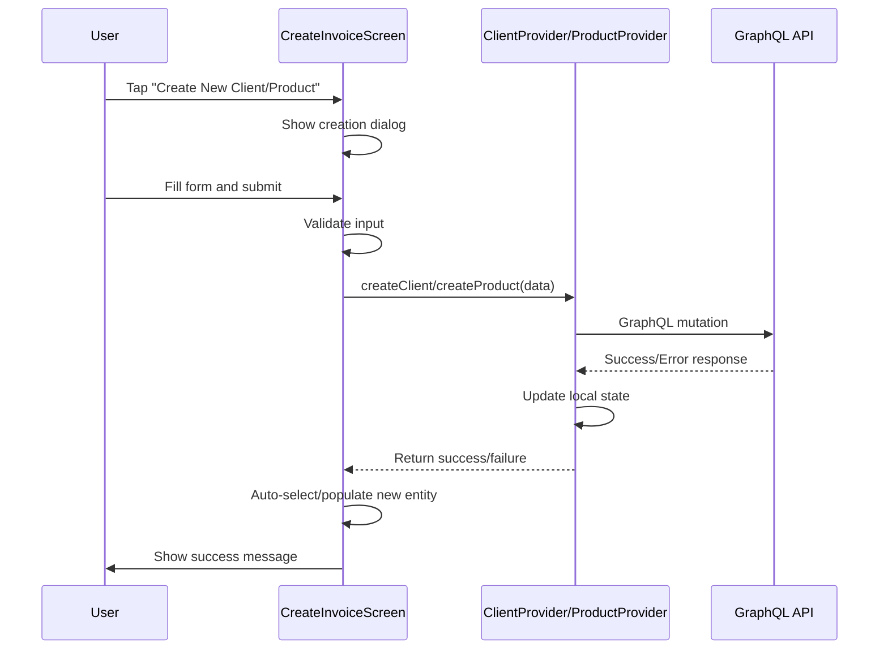

# Design Document: Inline Client and Item Creation

## Overview

This feature adds inline creation capabilities for clients and products directly within the invoice creation screen. The design follows Flutter's modern UI patterns and integrates seamlessly with the existing Riverpod state management architecture. The implementation will modify the existing `create_invoice_screen.dart` to add "Create New" buttons in the client and item selection modals, which will open inline form dialogs for data entry. Upon successful creation, the new entities will be automatically selected/populated in the invoice form.

The design prioritizes user experience by:
- Minimizing navigation and context switching
- Providing immediate feedback on creation success/failure
- Maintaining visual consistency with existing UI patterns
- Ensuring proper error handling and validation

## Architecture

### Component Structure

```
CreateInvoiceScreen (StatefulWidget)
├── _selectClient() - Client selection modal
│   └── [NEW] "Create New Client" button
│       └── _showClientCreationDialog() - Inline client form
│
├── _addItem() - Item selection modal
│   └── [NEW] "Create New Product" button
│       └── _showProductCreationDialog() - Inline product form
│
├── ClientProvider (Riverpod)
│   └── createClient() - Existing method
│
└── ProductProvider (Riverpod)
    └── createProduct() - Existing method
```

### State Management Flow



### Integration Points

1. **Client Selection Modal** (`_selectClient` method)
   - Add "Create New Client" button at the top of the modal
   - Button triggers `_showClientCreationDialog()`
   - On success, auto-select the new client

2. **Item Selection Modal** (`_addItem` method)
   - Add "Create New Product" button at the top of the modal
   - Button triggers `_showProductCreationDialog()`
   - On success, auto-populate the item form with product data

3. **State Providers**
   - Use existing `ClientProvider.createClient()` method
   - Use existing `ProductProvider.createProduct()` method
   - Both methods already handle state updates and API calls

## Components and Interfaces

### 1. Client Creation Dialog

**Purpose:** Inline form for creating new clients without leaving the invoice screen.

**UI Components:**
- Modal bottom sheet with rounded top corners
- Form fields:
  - Client Name (required, TextFormField)
  - Email (optional, TextFormField with email validation)
  - Phone (optional, TextFormField)
  - Address (optional, TextFormField, multiline)
- Action buttons:
  - "Cancel" button (outlined)
  - "Create Client" button (elevated, primary color)
- Loading indicator during submission
- Error message display area

**Method Signature:**
```dart
Future<Client?> _showClientCreationDialog(BuildContext context, WidgetRef ref)
```

**Behavior:**
- Returns `Client?` - the newly created client or null if cancelled
- Validates required fields before submission
- Shows loading state during API call
- Displays error messages on failure
- Automatically closes on success

### 2. Product Creation Dialog

**Purpose:** Inline form for creating new products without leaving the invoice screen.

**UI Components:**
- Modal bottom sheet with rounded top corners
- Form fields:
  - Product Name (required, TextFormField)
  - Description (optional, TextFormField, multiline)
  - Price (required, TextFormField with number validation)
  - Tax Rate (optional, TextFormField with percentage validation, default: 0)
  - Unit of Measure (optional, TextFormField, default: "unit")
- Action buttons:
  - "Cancel" button (outlined)
  - "Create Product" button (elevated, primary color)
- Loading indicator during submission
- Error message display area

**Method Signature:**
```dart
Future<Product?> _showProductCreationDialog(BuildContext context, WidgetRef ref)
```

**Behavior:**
- Returns `Product?` - the newly created product or null if cancelled
- Validates required fields before submission
- Shows loading state during API call
- Displays error messages on failure
- Automatically closes on success

### 3. Modified Client Selection Modal

**Changes to `_selectClient` method:**
- Add a "Create New Client" button at the top of the client list
- Button styled with primary color and icon
- On tap, call `_showClientCreationDialog()`
- If dialog returns a client, auto-select it and close the modal

**UI Layout:**
```
┌─────────────────────────────────┐
│  Select Client                  │
├─────────────────────────────────┤
│  [+] Create New Client          │ ← NEW
├─────────────────────────────────┤
│  ○ John Doe                     │
│    john@example.com             │
├─────────────────────────────────┤
│  ○ Jane Smith                   │
│    jane@example.com             │
└─────────────────────────────────┘
```

### 4. Modified Item Selection Modal

**Changes to `_addItem` method:**
- Add a "Create New Product" button at the top of the form
- Button styled with primary color and icon
- On tap, call `_showProductCreationDialog()`
- If dialog returns a product, auto-populate the form fields

**UI Layout:**
```
┌─────────────────────────────────┐
│  Add Line Item                  │
├─────────────────────────────────┤
│  [+] Create New Product         │ ← NEW
├─────────────────────────────────┤
│  Select from Products (Optional)│
│  [Dropdown]                     │
├─────────────────────────────────┤
│  Description                    │
│  Quantity | Unit Price          │
│  Tax %    | Unit                │
└─────────────────────────────────┘
```

## Data Models

### Client Creation Input

The client creation dialog will collect and send the following data structure to `ClientProvider.createClient()`:

```dart
Map<String, dynamic> {
  'business_id': String,        // From BusinessProvider
  'client_name': String,        // Required
  'email': String?,             // Optional, validated
  'phone': String?,             // Optional
  'address': String?,           // Optional
  'status': 'ACTIVE',           // Default value
}
```

**Field Mappings to GraphQL:**
- `client_name` → Used to populate `company_name` or `first_name`/`last_name` in mutation
- `email` → `email`
- `phone` → `phone`
- `address` → Will need to be structured as address object if backend expects it
- `business_id` → `businessId`

### Product Creation Input

The product creation dialog will collect and send the following data structure to `ProductProvider.createProduct()`:

```dart
Map<String, dynamic> {
  'business_id': String,        // From BusinessProvider
  'product_name': String,       // Required (maps to 'name' in GraphQL)
  'description': String?,       // Optional
  'price': double,              // Required (maps to 'unitPrice' in GraphQL)
  'tax_rate': double?,          // Optional, default 0.0
  'unit': String?,              // Optional, default 'unit' (maps to 'unitOfMeasure')
  'status': 'ACTIVE',           // Default value (maps to 'isActive')
}
```

**Field Mappings to GraphQL:**
- `product_name` → `name`
- `price` → `unitPrice`
- `unit` → `unitOfMeasure`
- `status` → `isActive`
- `business_id` → `businessId`

### Client Model (Existing)

```dart
class Client {
  final String id;
  final String businessId;
  final String clientName;
  final String? email;
  final String? phone;
  final String? website;
  final Address? address;
  final String? taxNumber;
  final String? notes;
  final String status;
  final DateTime createdAt;
  final DateTime updatedAt;
}
```

### Product Model (Existing)

```dart
class Product {
  final String id;
  final String businessId;
  final String productName;
  final String? description;
  final String? category;
  final double price;
  final String? sku;
  final String? unit;
  final int? quantity;
  final double? taxRate;
  final String status;
  final DateTime createdAt;
  final DateTime updatedAt;
}
```


## Correctness Properties

*A property is a characteristic or behavior that should hold true across all valid executions of a system—essentially, a formal statement about what the system should do. Properties serve as the bridge between human-readable specifications and machine-verifiable correctness guarantees.*

### Property 1: Client Creation and Selection

*For any* valid client data (non-empty name, optional valid email, optional phone, optional address), when the user creates a client through the Client_Creation_Dialog, the ClientProvider should successfully create the client via the GraphQL API, add it to the local state, and the Invoice_Creation_Screen should automatically select the newly created client.

**Validates: Requirements 1.4, 1.5, 1.6**

### Property 2: Product Creation and Population

*For any* valid product data (non-empty name, positive price, optional description, optional tax rate 0-100, optional unit), when the user creates a product through the Product_Creation_Dialog, the ProductProvider should successfully create the product via the GraphQL API, add it to the local state, and the Invoice_Creation_Screen should automatically populate the item form with the product data.

**Validates: Requirements 2.4, 2.5, 2.6**

### Property 3: Email Validation

*For any* string input in the email field of the Client_Creation_Dialog, the validation should accept only strings that match valid email format (contains @ symbol, has domain, etc.) and reject all other strings.

**Validates: Requirements 3.2**

### Property 4: Price Validation

*For any* numeric input in the price field of the Product_Creation_Dialog, the validation should accept only positive numbers (greater than 0) and reject zero, negative numbers, and non-numeric values.

**Validates: Requirements 3.4**

### Property 5: Tax Rate Validation

*For any* numeric input in the tax rate field of the Product_Creation_Dialog, the validation should accept only numbers between 0 and 100 (inclusive) and reject values outside this range and non-numeric values.

**Validates: Requirements 3.5**

### Property 6: Business Context Inclusion for Clients

*For any* client creation request, the ClientProvider should automatically include the current business ID from the BusinessProvider in the GraphQL mutation input, ensuring all clients are properly associated with the active business.

**Validates: Requirements 6.1**

### Property 7: Business Context Inclusion for Products

*For any* product creation request, the ProductProvider should automatically include the current business ID from the BusinessProvider in the GraphQL mutation input, ensuring all products are properly associated with the active business.

**Validates: Requirements 6.2**

## Error Handling

### Client Creation Errors

**Validation Errors:**
- Empty client name → Display inline error: "Client name is required"
- Invalid email format → Display inline error: "Please enter a valid email address"
- Missing business context → Display error: "Business context is required. Please select a business first."

**API Errors:**
- Network failure → Display snackbar: "Network error. Please check your connection and try again."
- Server error (500) → Display snackbar: "Server error. Please try again later."
- Duplicate client → Display snackbar: "A client with this name already exists."
- Unauthorized (401) → Display snackbar: "Session expired. Please log in again."

**Error Recovery:**
- Keep dialog open on validation errors so user can correct input
- Close dialog and show snackbar on API errors
- Preserve form data on API errors so user doesn't lose their input
- Provide retry mechanism for network failures

### Product Creation Errors

**Validation Errors:**
- Empty product name → Display inline error: "Product name is required"
- Invalid price (zero, negative, non-numeric) → Display inline error: "Price must be a positive number"
- Invalid tax rate (< 0 or > 100) → Display inline error: "Tax rate must be between 0 and 100"
- Missing business context → Display error: "Business context is required. Please select a business first."

**API Errors:**
- Network failure → Display snackbar: "Network error. Please check your connection and try again."
- Server error (500) → Display snackbar: "Server error. Please try again later."
- Duplicate product → Display snackbar: "A product with this name already exists."
- Unauthorized (401) → Display snackbar: "Session expired. Please log in again."

**Error Recovery:**
- Keep dialog open on validation errors so user can correct input
- Close dialog and show snackbar on API errors
- Preserve form data on API errors so user doesn't lose their input
- Provide retry mechanism for network failures

### State Consistency

**Handling Race Conditions:**
- Disable submit button during API calls to prevent duplicate submissions
- Use loading state to prevent multiple simultaneous creation requests
- If user navigates away during creation, cancel the request

**Rollback Strategy:**
- If API call succeeds but state update fails, log error and refresh provider data
- If auto-selection fails after client creation, show success message but don't select
- If auto-population fails after product creation, show success message but don't populate

## Testing Strategy

### Unit Tests

Unit tests will focus on specific examples, edge cases, and error conditions:

**Client Creation Dialog Tests:**
- Test that "Create New Client" button appears in client selection modal
- Test that tapping button opens the client creation dialog
- Test that dialog contains all required form fields (name, email, phone, address)
- Test that empty client name shows validation error
- Test that canceling dialog returns to client selection without creating client
- Test that loading indicator appears during API call
- Test that success message appears after successful creation
- Test that error message appears on API failure
- Test that submit button is disabled during API call
- Test that dialog closes after successful creation

**Product Creation Dialog Tests:**
- Test that "Create New Product" button appears in item selection modal
- Test that tapping button opens the product creation dialog
- Test that dialog contains all required form fields (name, description, price, tax rate, unit)
- Test that empty product name shows validation error
- Test that canceling dialog returns to item selection without creating product
- Test that loading indicator appears during API call
- Test that success message appears after successful creation
- Test that error message appears on API failure
- Test that submit button is disabled during API call
- Test that dialog closes after successful creation

**Edge Cases:**
- Test empty client name validation (edge case from 3.1)
- Test empty product name validation (edge case from 3.3)
- Test missing business context error (edge case from 6.3)

### Property-Based Tests

Property-based tests will verify universal properties across all inputs. Each test should run a minimum of 100 iterations with randomized inputs.

**Property Test 1: Client Creation and Selection**
- Generate random valid client data (non-empty names, valid emails, phone numbers, addresses)
- Call client creation through the dialog
- Verify API is called with correct data
- Verify client is added to provider state
- Verify client is auto-selected in invoice form
- **Tag: Feature: inline-client-item-creation, Property 1: Client Creation and Selection**

**Property Test 2: Product Creation and Population**
- Generate random valid product data (non-empty names, positive prices, descriptions, tax rates 0-100, units)
- Call product creation through the dialog
- Verify API is called with correct data
- Verify product is added to provider state
- Verify item form is populated with product data
- **Tag: Feature: inline-client-item-creation, Property 2: Product Creation and Population**

**Property Test 3: Email Validation**
- Generate random strings (valid emails, invalid emails, empty strings, special characters)
- Test validation function with each string
- Verify only valid email formats are accepted
- **Tag: Feature: inline-client-item-creation, Property 3: Email Validation**

**Property Test 4: Price Validation**
- Generate random numbers (positive, zero, negative, very large, very small, non-numeric strings)
- Test validation function with each value
- Verify only positive numbers are accepted
- **Tag: Feature: inline-client-item-creation, Property 4: Price Validation**

**Property Test 5: Tax Rate Validation**
- Generate random numbers (0-100, negative, > 100, decimals, non-numeric strings)
- Test validation function with each value
- Verify only values between 0 and 100 are accepted
- **Tag: Feature: inline-client-item-creation, Property 5: Tax Rate Validation**

**Property Test 6: Business Context Inclusion for Clients**
- Generate random client data
- Mock BusinessProvider with random business IDs
- Call client creation
- Verify business ID is included in API call data
- **Tag: Feature: inline-client-item-creation, Property 6: Business Context Inclusion for Clients**

**Property Test 7: Business Context Inclusion for Products**
- Generate random product data
- Mock BusinessProvider with random business IDs
- Call product creation
- Verify business ID is included in API call data
- **Tag: Feature: inline-client-item-creation, Property 7: Business Context Inclusion for Products**

### Testing Framework

**Flutter Testing Tools:**
- `flutter_test` package for unit and widget tests
- `mockito` for mocking providers and API calls
- `faker` package for generating random test data
- Widget testing for UI interactions and state changes

**Test Configuration:**
- Property tests: Minimum 100 iterations per test
- Mock GraphQL API responses for consistent testing
- Use `pumpAndSettle()` for async UI updates
- Test both success and failure scenarios

### Integration Testing

**End-to-End Flows:**
1. Open invoice screen → Open client modal → Create new client → Verify auto-selection
2. Open invoice screen → Open item modal → Create new product → Verify auto-population
3. Create client with invalid email → Verify validation error
4. Create product with invalid price → Verify validation error
5. Simulate API failure → Verify error handling and recovery

**Test Environment:**
- Use test database with isolated business context
- Mock authentication and business selection
- Test with various screen sizes and orientations
- Test dark mode rendering
